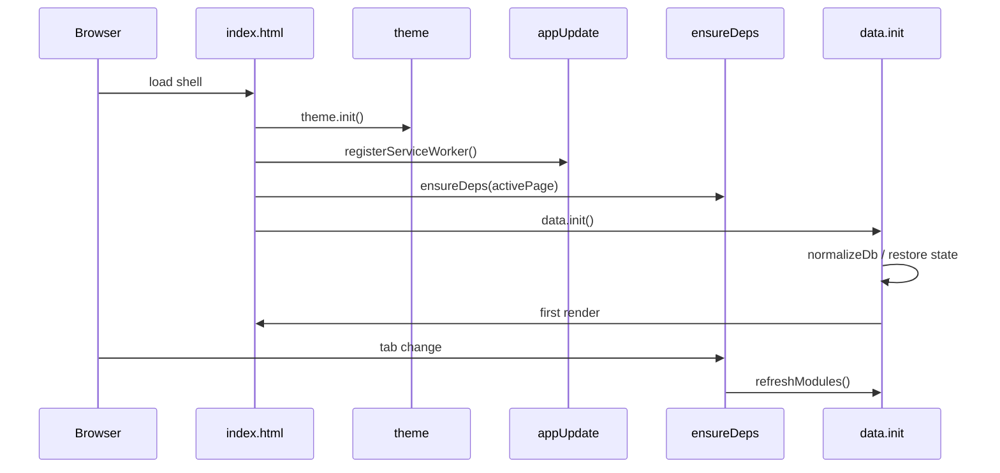
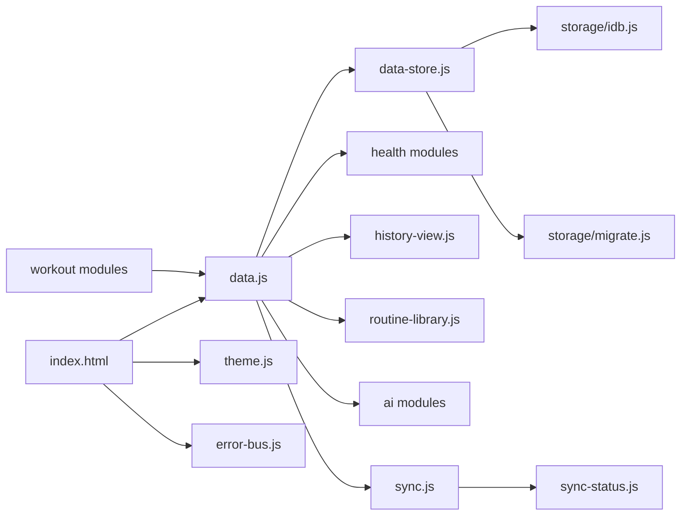
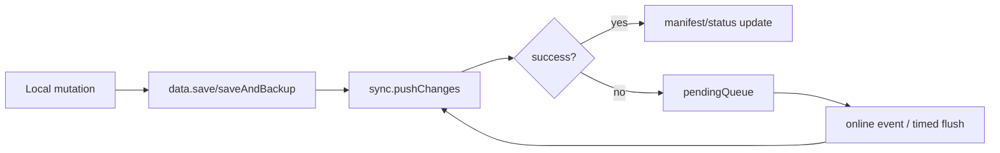

# Architecture

## Structure

- root `*.js`: browser runtime modules in IIFE/global-object style
- `storage/`: adapters and migration helpers
- `scripts/`: maintenance/build tools using ESM
- `test/`: node:test suites for pure logic
- `docs/`: design and operations documentation

## Runtime Globals

- `window.data`
- `window.workout`
- `window.ai`
- `window.sync`
- `window.syncStatus`
- `window.errorBus`
- `window.theme`
- `window.backup`

## Startup Sequence

## Module Graph

## Sync Flow

