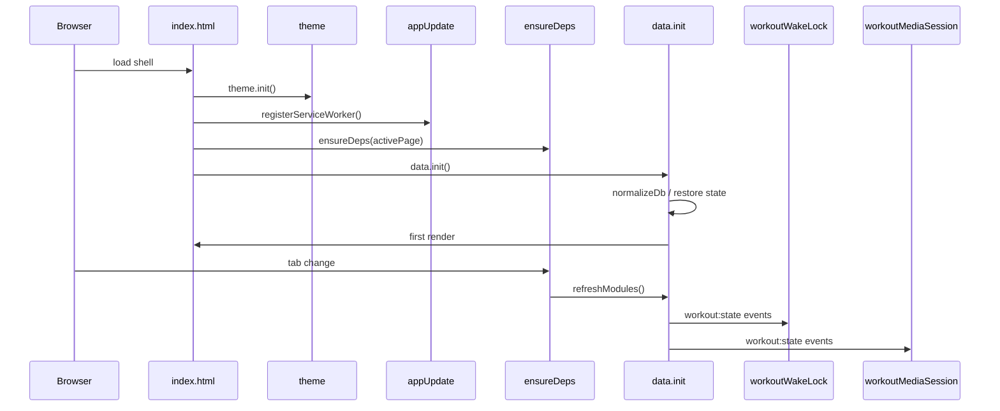
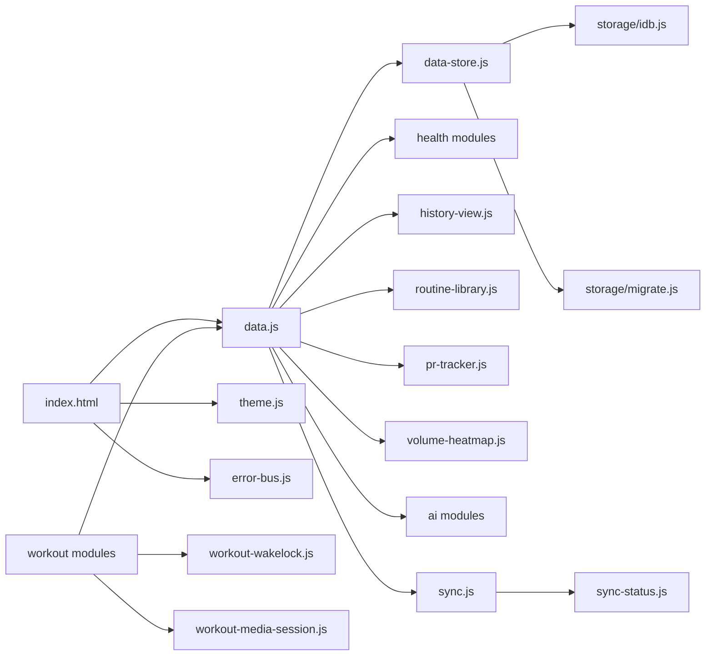
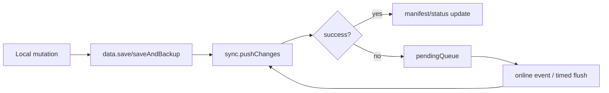

# Architecture

## Structure

- root `*.js`: browser runtime modules in IIFE/global-object style
- `storage/`: adapters and migration helpers
- `scripts/`: maintenance/build tools using ESM
- `test/`: node:test suites for pure logic
- `docs/`: design and operations documentation

## Runtime Globals

- `window.data`
- `window.workout`
- `window.ai`
- `window.sync`
- `window.syncStatus`
- `window.errorBus`
- `window.theme`
- `window.backup`
- `window.prTracker`
- `window.volumeHeatmap`

## Startup Sequence

## Module Graph

## Sync Flow

## Profile Page Layout

- `#profile` overview rendered by `data.renderProfileIdentityCard()` as single identity card
- Sub-tabs: library / weightloss / ai / sync (`data.routineView`)
- Theme/dark/language controlled by top-bar `.theme-trigger` opening `#themeSheet`
- `#profileSettings` container holds `[data-settings="ai"]` and `[data-settings="sync"]` cards, toggled by sub-tab

### Library Sub-Module

- 「库」子 Tab 内含两段视图：`actions`（动作库）/`routines`（方案库）
- 状态字段：`db.libraryView`（当前段）与 `db.libraryFilterTag`（共享标签过滤）
- 交互：点击 segment 与左右滑动 deck 都通过 `data.setLibraryView()` 同步
- 标签字典通过 `data.collectLibraryTags()` 从 actions+routines 合并去重
- 删除动作前通过 `countActionReferences()` 计算被方案引用次数并提示风险
